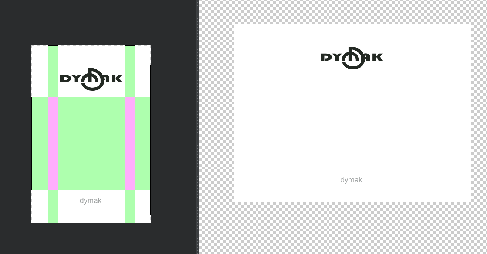
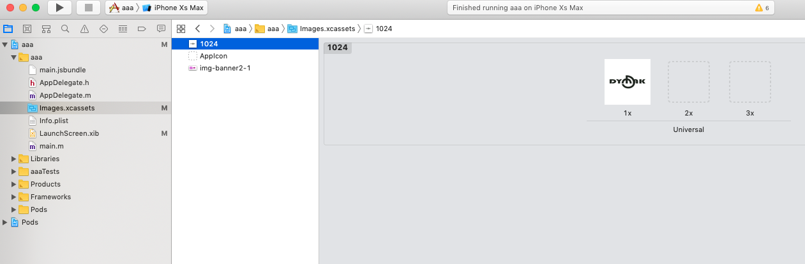
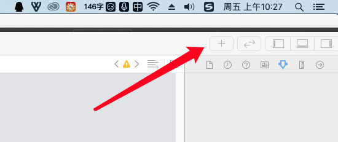
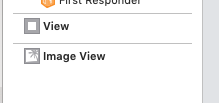
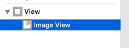
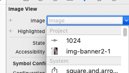
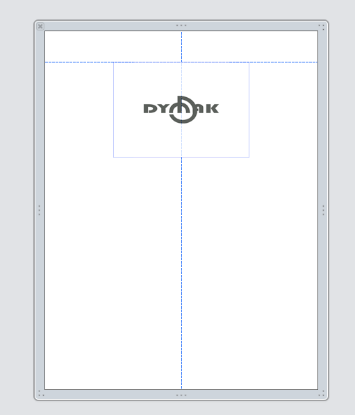
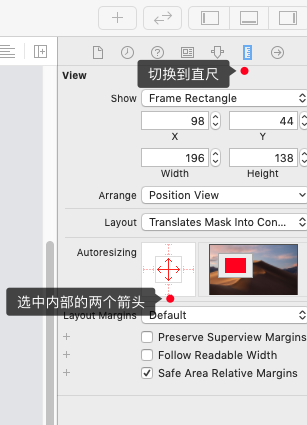
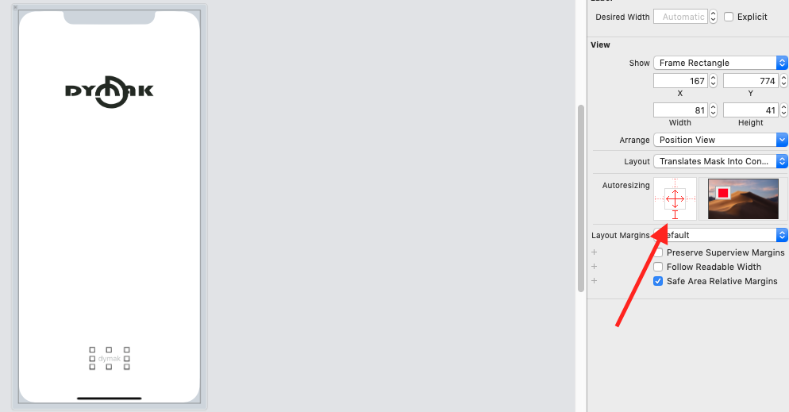

<h1><%= projectName %></h1>

<%= projectDescription %>

根据官方的 `react-native init AwesomeProject` 生成项目,集成`mobx`,`react-native-router-flux`路由,`react-native-root-toast`弹窗.

# 1. 目录结构
```text
├─api
├─assets  // 静态资源(图片,音频等)
│  └─img
│      └─icon
├─components  // 自定义组件
│  ├─Divider
│  └─XButton
├─mobx  // 状态的存储和管理
├─router  // 路由文件
├─style  // 
│  └─util
├─utils  // 
└─views  // 所有前台页面
    ├─tab  // 底部 tab 栏对应的页面
    │  ├─home
    │  └─Mine
    ├─TTTTTTTest  // 其他页面
    │  ├─index.js  // 页面代码
    │  └─style.js  // 页面样式
```

# 2. 路由 & 状态
## 2.1. 路由 [react-native-router-flux](https://github.com/aksonov/react-native-router-flux)
文档: https://github.com/aksonov/react-native-router-flux/blob/master/docs/API.md

## 2.2. 状态管理 
[mobx-react](https://github.com/mobxjs/mobx-react)
- [React-Native + Mobx一步步构建项目](https://segmentfault.com/a/1190000014165693)
- [mobx 官方文档](https://mobx.js.org/refguide/observer-component.html)


# 3. 初始化项目
1. 初始化项目: react-native init cy[projectname]

# 4. 关于打包
<https://reactnative.cn/docs/signed-apk-android/>

## 4.1. 生成一个签名密钥
你可以用keytool命令生成一个私有密钥。在 Windows 上keytool命令放在 JDK 的 bin 目录中（比如C:\Program Files\Java\jdkx.x.x_x\bin），你可能需要在命令行中先进入那个目录才能执行此命令。

    keytool -genkeypair -v -keystore my-release-key.keystore -alias my-key-alias -keyalg RSA -keysize 2048 -validity 10000

这条命令会要求你输入密钥库（keystore）和对应密钥的密码(本项目以 `123456` 为例)，然后设置一些发行相关的信息。最后它会生成一个叫做my-release-key.keystore的密钥库文件。


## 4.2. 设置 gradle 变量
把my-release-key.keystore文件放到你工程中的android/app文件夹下。
编辑项目目录/android/gradle.properties（项目配置，只对所在项目有效）。如果没有gradle.properties文件你就自己创建一个，添加如下的代码（注意把其中的123456替换为相应密码）
```text
MYAPP_RELEASE_STORE_FILE=my-release-key.keystore
MYAPP_RELEASE_KEY_ALIAS=my-key-alias
MYAPP_RELEASE_STORE_PASSWORD=123456
MYAPP_RELEASE_KEY_PASSWORD=123456
```

## 4.3. 把签名配置加入到项目的 gradle 配置中
编辑你项目目录下的android/app/build.gradle，添加如下的签名配置：
```text
...
android {
    ...
    defaultConfig { ... }
    signingConfigs {
        // 1. release 签名配置
        release {
            if (project.hasProperty('MYAPP_RELEASE_STORE_FILE')) {
                storeFile file(MYAPP_RELEASE_STORE_FILE)
                storePassword MYAPP_RELEASE_STORE_PASSWORD
                keyAlias MYAPP_RELEASE_KEY_ALIAS
                keyPassword MYAPP_RELEASE_KEY_PASSWORD
            }
        }
    }
    buildTypes {
        release {
            ...
            // 2. 修改 release 签名配置
            signingConfig signingConfigs.release
        }
    }
}
...
```

***
执行`yarn run release`会开始打包 release,并在完成后自动打开所在文件夹

rn 打包的测试 apk: android\app\build\outputs\apk\debug

rn 打包的正式 apk: android\app\build\outputs\apk\release

npm script 执行 `yarn run open-release-folder` 可以打开对应文件夹


## 4.4. 重命名 release 的包名
修改 `app/build.gradle`,找到 `variant.outputs.each` 在遍历的{}最底部增加
```text
    applicationVariants.all { variant ->
        variant.outputs.each { output ->
            ...

            // 重命名包名,中文会导致无法安装
            def date = new Date()
            def formattedDate = date.format('yyyyMMdd-HHmmss')
            // applicationId 和版本定义在上面 defaultConfig
            output.outputFileName = "${applicationId}_v${versionName}_${formattedDate}.apk"
        }
    }
```
打出的包名为 `com.rn61test_v1.0.0_20191109-221253.apk`

# 5. 插件集成
## 5.1. 弹窗提示
[react-native-root-toast](https://github.com/magicismight/react-native-root-toast). 

已经在入口 `index.js` 全局挂载,在项目里直接调用 `$warn` 即可
## 5.2. 图片选择,拍照
按照文档配置,添加权限

https://github.com/syanbo/react-native-syan-image-picker

可能需要修改 `minSdkVersion` 16 => 17

IOS 权限 项目目录->Info.plist->增加
```text
	<key>NSCameraUsageDescription</key>
	<string>需要访问相机</string>
	<key>NSLocationWhenInUseUsageDescription</key>
	<string>我们需要通过您的地理位置信息获取您周边的相关数据</string>
	<key>NSPhotoLibraryAddUsageDescription</key>
	<string>请求保存图片到相册</string>
	<key>NSPhotoLibraryUsageDescription</key>
	<string>请允许访问相册以选取照片</string>
```
## 5.3. 安卓和 IOS 都能用的 ActionSheet
无需重新打包 
https://github.com/gaoxiaosong/react-native-general-actionsheet


## 5.4. 安装后导致 react-native-root-toast 无效.

因为你装了两次 react-native-root-siblings,一个4.0,一个3.x

解决办法: 固定版本 "react-native-root-toast": "3.1.2"


## 5.5. 启动页 [react-native-splash-screen](https://github.com/crazycodeboy/react-native-splash-screen)
### 5.5.1. Android
先安装

    npm i react-native-splash-screen --save
    
- android 修改 `MainActivity.java` 来使用启动页 
```text
package com.<%= projectName %>;

import com.facebook.react.ReactActivity;
import android.os.Bundle; // 启动页 here

// react-native-splash-screen >= 0.3.1
import org.devio.rn.splashscreen.SplashScreen; // 启动页 here

public class MainActivity extends ReactActivity {

  /**
   * Returns the name of the main component registered from JavaScript. This is used to schedule
   * rendering of the component.
   */
  @Override
  protected String getMainComponentName() {
    return "<%= projectName %>";
  }
    @Override
    protected void onCreate(Bundle savedInstanceState) {
        SplashScreen.show(this);  // 启动页 here
        super.onCreate(savedInstanceState);
    }
}
```
创建一个 launch_screen.xml 在 app/src/main/res/layout 复制以下内容:

```text
<?xml version="1.0" encoding="utf-8"?>
<FrameLayout
        xmlns:android="http://schemas.android.com/apk/res/android"
        android:layout_width="match_parent"
        android:layout_height="match_parent"
        android:orientation="vertical"
>

    <ImageView
        android:layout_width="match_parent"
        android:layout_height="match_parent"
        android:contentDescription="@string/app_name"
        android:scaleType="centerCrop"
        android:src="@drawable/screen"></ImageView>
</FrameLayout>
```
这段代码使用一个带 scaleType 的 ImageView 作为启动图,android 会自动伸缩.
你可以在以下文件夹中创建启动图

    drawable-ldpi
    drawable-mdpi
    drawable-hdpi
    drawable-xhdpi
    drawable-xxhdpi
    drawable-xxxhdpi

添加一个叫 primary_dark 的颜色,在 `app/src/main/res/values/colors.xml`. 虽然我也不知道这个有什么用.

    <?xml version="1.0" encoding="utf-8"?>
    <resources>
        <color name="primary_dark">#000000</color>
    </resources>

> 关于启动图的额外内容 .9.PNG

.9.PNG是安卓开发里面的一种特殊的图片，这种格式的图片通过 Android Studio 自带的编辑工具生成，使用九宫格切分的方法。点九图是一种可拉伸的位图，android会自动调整它的大小，来使图像在充当背景时可以在界面中自适应展示
图中绿色的部分会被拉伸,但图片分辨率过大时在背景图只能显示部分,目前不知道怎么调整

如果要学习相关内容可以点击
<https://www.cnblogs.com/whycxb/p/9737613.html>


### 5.5.2. ios 

```text

```

## 5.6. 极光推送 [jpush-react-native](https://github.com/jpush/jpush-react-native)
### 5.6.1. 安装两个依赖
```text
npm install jpush-react-native jcore-react-native --save
```

### 5.6.2. 配置
#### 5.6.2.1. Android
截止 2.7.5 版本,仍然无法自动 link,所以需要手动添加.

- app/build.gradle
```text
android {
  defaultConfig {
      applicationId "yourApplicationId"           //在此替换你的应用包名
      ...
      manifestPlaceholders = [
              JPUSH_APPKEY: "yourAppKey",         //在此替换你的APPKey
              JPUSH_CHANNEL: "yourChannel"        //在此替换你的channel
      ]
  }
}
```

```text
dependencies {
      ...
      implementation project(':jpush-react-native')  // 添加 jpush 依赖
      implementation project(':jcore-react-native')  // 添加 jcore 依赖
  }
```
- setting.gradle
```text
include ':jpush-react-native'
project(':jpush-react-native').projectDir = new File(rootProject.projectDir, '../node_modules/jpush-react-native/android')
include ':jcore-react-native'
project(':jcore-react-native').projectDir = new File(rootProject.projectDir, '../node_modules/jcore-react-native/android')

```
- AndroidManifest.xml
```text
<meta-data
	android:name="JPUSH_CHANNEL"
	android:value="${JPUSH_CHANNEL}" />
<meta-data
	android:name="JPUSH_APPKEY"
	android:value="${JPUSH_APPKEY}" />   
```
#### 5.6.2.2. IOS
首先把需要的资源图片拖到 Images.xcassets



1. 打开 LaunchScreen.xib，删除 View 及 View 下的所有内容
2. 点击右上角的加号，添加一个 View 和 Image View
    
    添加完成

    
3. 把 Image View 拖到 View 内

    
4. 设置 Image View 的图片路径

    

5. 拖动图片到合适位置

    

6. 点击直尺 icon，选中 AutoSizing 内的两个箭头。鼠标移到右侧可以看到容器随着设备尺寸变化而变化 

    

7. 同理添加一个文字并移动到底部，选中 AutoSizing 内的两个箭头和底部的一个箭头，使其大小自适应并固定在底部。
    可以切换不同的设备查看效果，如果文字被遮盖可以调整 width 和 height

    


### 5.6.3. 集成完成测试

集成后先测试能否 getRegistrationID,ios 和 android 回调的结构不同 

`let registerID = typeof result === 'string' ? result : result.registerID`

到[极光控制台](https://www.jiguang.cn/dev2/#/overview/appCardList) -> [选择/创建应用] -> 应用设置 -> 推送设置

- 安卓 只需设置 应用包名. 

- ios 主要问题是[证书设置](http://docs.jiguang.cn/jpush/client/iOS/ios_cer_guide/),根据文档生成 p12 文件上传到`iOS生产证书`,并勾选`是否将生产证书用于开发环境`


点击左侧栏 极光推送 -> 发送通知

模拟器没有`registerID`,如果真机可以收到通知则表明集成成功

### 5.6.4. 注意问题


# 6. 常见问题
## 6.1. Android 9 无法联网
因为谷歌要求默认使用加密连接.
在res下新建一个xml目录 创建名为 `network_security_config.xml` 文件 ，该文件内容如下：
```xml
<?xml version="1.0" encoding="utf-8"?>
<network-security-config>
    <base-config cleartextTrafficPermitted="true" />
</network-security-config>
```
然后在 AndroidManifest.xml application 标签内应用上面的xml配置：
`
android:networkSecurityConfig="@xml/network_security_config"
`

## 6.2. 在 Android 上支持 GIF 和 WebP 格式图片
默认情况下 Android 是不支持 GIF 和 WebP 格式的。你需要在android/app/build.gradle文件中根据需要手动添加以下模块：
```
dependencies {
  // 如果你需要支持Android4.0(API level 14)之前的版本
  implementation 'com.facebook.fresco:animated-base-support:1.3.0'

  // 如果你需要支持GIF动图
  implementation 'com.facebook.fresco:animated-gif:2.0.0'

  // 如果你需要支持WebP格式，包括WebP动图
  implementation 'com.facebook.fresco:animated-webp:2.1.0'
  implementation 'com.facebook.fresco:webpsupport:2.0.0'

  // 如果只需要支持WebP格式而不需要动图
  implementation 'com.facebook.fresco:webpsupport:2.0.0'
}
```

## 6.3. 在 FlatList/ScrollView 中 margin 不生效,重叠了怎么办?
给 FlatList/ScrollView 组件添加
```
    contentContainerStyle={{paddingBottom:xxx}}
```

## 6.4. mobx 中的数据不能响应
检查是否有给组件添加 `@observer` ,用于渲染 mobx 数据的下级组件同样需要添加 `@observer` 

## 6.5. ios 报错 No bundle URL present
检查是否有给组件添加 `@observer` ,用于渲染 mobx 数据的下级组件同样需要添加 `@observer` 

1. 删除: main.jsbundle
2. 新建一个文件，选择 Other -> Empty,保存为 main.jsbundle
3. 运行命令: react-native bundle --entry-file index.js --platform ios --dev false --bundle-output ios/main.jsbundle --assets-dest ios

等待执行完成，重新打包 run-ios


# 7. License
MIT
